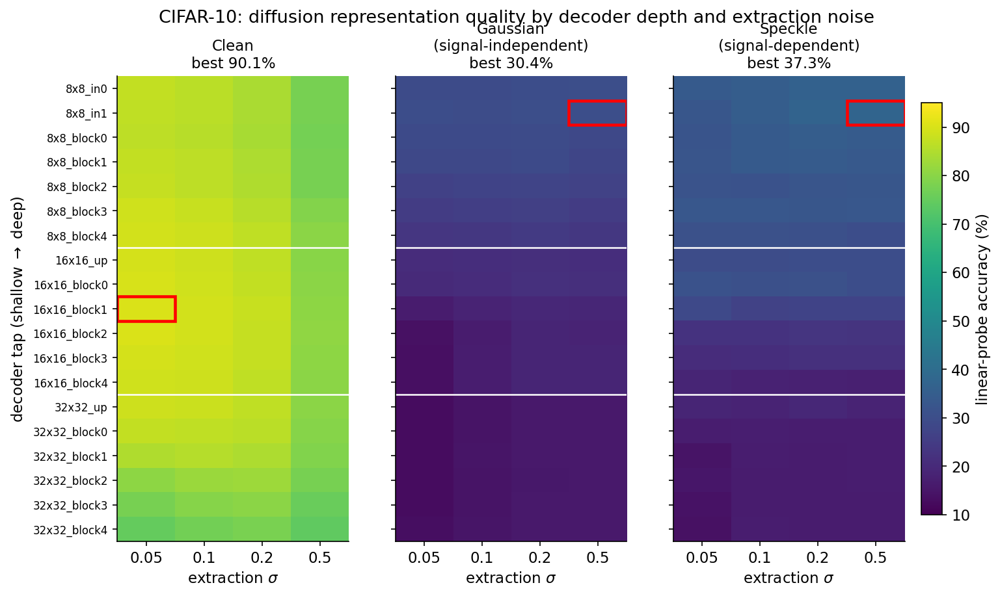
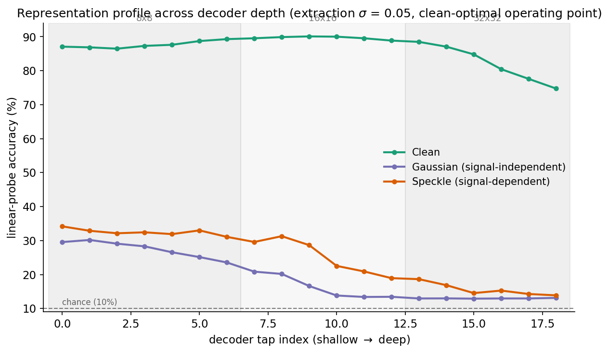
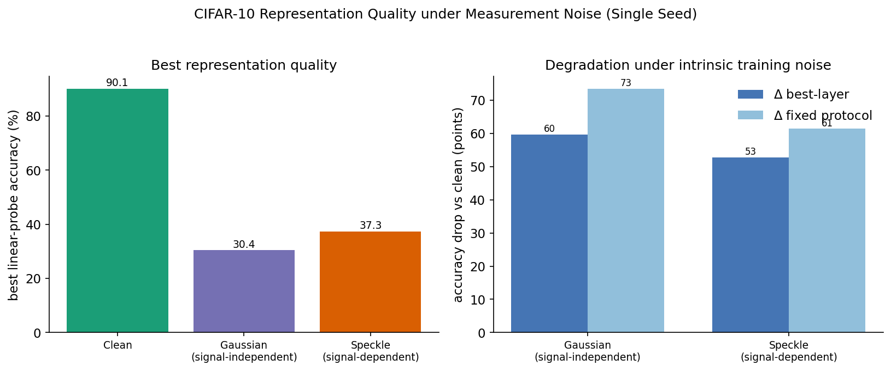

# Diffusion-Representations-under-Measurement-Noise
Author: Oankar Patil

*Do the representations a diffusion model learns survive when it is trained on intrinsically noisy data, and does the **structure** of that noise matter, or only its magnitude?*

This repository reproduces the known clean-data representation behavior of diffusion models using NVIDIA's [EDM](https://github.com/NVlabs/edm) backbone, then runs a controlled, matched-variance experiment to ask how signal-dependent measurement noise, **the kind pervasive in scientific imaging (low-light microscopy, MRI, astronomy)**, affects representation quality.

> **Status:** Compute limited by Google Colab, but the qualitative effects are solid, however, the precise magnitudes are not final. See [Limitations](#limitations).

<p align="center">
  
</p>

**Main Finding Summarized (CIFAR-10):** A clean-trained diffusion model reproduces the literature-established representation profile (best features mid-up-sampling, at small extraction noise, left panel in fig above). Training on noisy data collapses that profile, and at *matched average variance*, signal-**independent** Gaussian noise degraded the representation **more** than signal-**dependent** speckle, suggesting it is the spatial structure of the corruption, not merely its magnitude, that drives the loss.

---

## Motivation

Diffusion models are usually framed as generators, but a denoising network trained for generation also learns **representations**: its intermediate activations are linearly separable by class, with no auxiliary encoder ([Xiang et al., DDAE, ICCV 2023](#references); [Chen et al., l-DAE, 2024](#references)). A single network is therefore *both a generator and a feature extractor*.

That property has only ever been studied on **clean** training data. But many of the domains where one would most want a single model to both generate and represent, scientific and medical imaging, have **intrinsic measurement noise** that is often **signal-dependent** (photon shot noise scales with intensity, speckle is multiplicative etc). The denoising objective is then trained against a corrupted target, which breaks the clean-data assumption underlying the representation-learning results above.

This project asks two questions:

1. **(H1)** Does training on intrinsically noisy data degrade the learned representations (probed on clean data)?
2. **(H2)** At *matched* average noise variance, does the **structure** of the noise (signal-independent vs signal-dependent) change the degradation, i.e., is it magnitude or structure that matters?

This extends my first-author work on **noise shortcuts in self-supervised learning** (SEANA — joint-embedding SSL) into the diffusion / reconstruction-based setting. Recent theory ([Van Assel et al., 2025](#references)) argues reconstruction-style objectives need stronger noise–augmentation alignment than joint-embedding ones under high-magnitude noise, so whether diffusion is more or less robust than SSL here is genuinely pretty open!

---

## Theoretical background
 
**Forward process as a Markov chain.** DDPM defines a forward Markov chain that gradually adds Gaussian noise,
 
$$q(x_t \mid x_{t-1}) = \mathcal{N}\!\left(\sqrt{1-\beta_t}\,x_{t-1},\,\beta_t I\right), \qquad q(x_t \mid x_0) = \mathcal{N}\!\left(\sqrt{\bar\alpha_t}\,x_0,\,(1-\bar\alpha_t) I\right),$$
 
with $\bar\alpha_t = \prod_{s\le t}(1-\beta_s)$. In the continuous limit this is a stochastic differential equation ([Song et al., 2021](#references)),
 
$$dx = f(x,t)\,dt + g(t)\,dw,$$
 
whose **variance-preserving (VP)** and **variance-exploding (VE)** forms recover DDPM and score-matching respectively. EDM works in the VE parameterization $x_t = x_0 + \sigma_t\,\varepsilon$, $\varepsilon\sim\mathcal N(0,I)$, treating the noise level $\sigma$ as the time variable.
 
**Score, denoiser, and Tweedie's formula.** Sampling runs the *reverse* SDE, which requires the score $\nabla_{x}\log p_t(x)$. For the VE Gaussian perturbation, Tweedie's formula links the score to the conditional mean (the optimal denoiser):
 
$$\mathbb{E}[x_0 \mid x_t] = x_t + \sigma^2 \nabla_{x_t}\log p_t(x_t) \quad\Longrightarrow\quad \nabla_{x_t}\log p_t(x_t) = \frac{D(x_t;\sigma) - x_t}{\sigma^2},$$
 
so a network trained to denoise *is* a score model. (This same identity is what [ambient](#references) and [consistent-Tweedie](#references) diffusion exploit to learn from corrupted data, directly relevant to the noisy-training question we're looking at.)
 
**EDM preconditioning.** Rather than predict noise directly, EDM wraps the raw network $F_\theta$ in $\sigma$-dependent scalings so the effective input/target are unit-variance across all noise levels:
 
$$D_\theta(x;\sigma) = c_\text{skip}(\sigma)\,x + c_\text{out}(\sigma)\,F_\theta\!\big(c_\text{in}(\sigma)\,x,\;c_\text{noise}(\sigma)\big),$$
 
$$c_\text{skip}=\frac{\sigma_d^2}{\sigma^2+\sigma_d^2},\quad c_\text{out}=\frac{\sigma\,\sigma_d}{\sqrt{\sigma^2+\sigma_d^2}},\quad c_\text{in}=\frac{1}{\sqrt{\sigma^2+\sigma_d^2}},\quad c_\text{noise}=\tfrac14\ln\sigma,$$
 
trained with the weighted denoising loss
 
$$\mathcal{L} = \mathbb{E}_{\sigma,\,x_0,\,\varepsilon}\!\left[\lambda(\sigma)\,\big\lVert D_\theta(x_0+\sigma\varepsilon;\,\sigma)-x_0\big\rVert^2\right], \qquad \lambda(\sigma)=\frac{\sigma^2+\sigma_d^2}{(\sigma\sigma_d)^2}.$$
 
The noise level is sampled log-normally, $\ln\sigma \sim \mathcal{N}(P_{\text{mean}} = -1.2,\ P_{\text{std}} = 1.2)$, with data scale $\sigma_d = 0.5$.
 
**Why intrinsic data noise is a problem:** All of the above assumes $x_0$ is clean. If the training data is itself a noisy measurement $\tilde x_0 = x_0 + n$, the denoiser is rewarded for reconstructing $n$, the score estimate is biased, and the low-noise representation band (where clean diffusion features are best) is exactly where the intrinsic noise dominates. That is the regime this project probes empirically.

---

## Method

### Backbone and reproduction
- **Model/objective:** NVIDIA EDM's `EDMPrecond` + `EDMLoss` + DDPM++ (`SongUNet`), used directly from the [official repo](https://github.com/NVlabs/edm). CIFAR-10 config: `model_channels=128`, `channel_mult=[2,2,2]`, `num_blocks=4`, attention @16, dropout 0.13, EMA (500 kimg), lr-rampup (10000 kimg), augment 0.12.
- **Probe (DDAE protocol):** Perturb a *clean* input to a small extraction $\sigma$, run it through the trained denoiser, tap each decoder block's activations, global-average-pool, and fit a linear classifier. Sweeping (decoder tap × extraction $\sigma$) gives the representation-quality surface.
- **Reproduction check:** The clean-trained model recovers the expected concave profile, best features in the **middle of up-sampling** (`16x16` blocks) at **small** $\sigma$, established literature's known profile.

### Controlled noise experiment
Three noise families are applied to the training data, each at the **same dataset-average post-clip variance** (matched MSE ⇔ matched PSNR), so that any difference in outcome is attributable to noise *structure*, not magnitude:

| Family | Per-pixel variance | Structure |
|---|---|---|
| **Gaussian** | $\sigma_g^2$ (constant) | signal-**independent** (uniform) |
| **Poisson–Gaussian** | $x/\lambda + \sigma_g^2$ | intensity-proportional |
| **Speckle** | $x^2\sigma_s^2$ | signal-**dependent** (multiplicative) |

Parameters are calibrated per family (closed-form init + Monte-Carlo + bisection) so realized post-clip MSE matches a target $V^\*$. Noise is **fixed per image** (a property of the training set, not an augmentation), and the probe is **always evaluated on clean test data** so we measure representation quality of clean semantics.

Reported metrics: **Δ best-layer** (each model's own best (tap, $\sigma$) vs clean's) and **Δ fixed-protocol** (all models evaluated at clean's optimal (tap, $\sigma$)). The gap between them quantifies how far the noisy models' optimal operating point has shifted.

---

## Results (CIFAR-10 - pilot)

<p align="center">
  
</p>

| Condition | Structure | Best probe acc | Δ best-layer | Δ fixed-protocol |
|---|---|---:|---:|---:|
| Clean | — | **90.1%** | — | — |
| Gaussian | signal-independent | 30.4% | 59.7 | 73.5 |
| Speckle | signal-dependent | 37.3% | 52.8 | 61.4 |
| Poisson–Gaussian | intensity-prop. | *(pending)* | | |

<p align="center">
  
</p>

**Observations.**
1. **Clean reproduces the literature**: Concave profile, peak at `16x16_block1`, small $\sigma$ (~90% at 8.7 MIMG, trending toward DDAE's ~95.9% ceiling). Currently limited by comptute for hitting DDAE ceiling.
2. **Noise collapses the profile:** Both noisy conditions lose the concave shape: the best features move to the **earliest** decoder taps, accuracy decays monotonically with depth, and the deepest taps fall to near chance. The small-$\sigma$ sweet spot disappears.
3. **Structure matters, not just magnitude (H2):** At matched average variance the two families differ by 7–12 points, *consistently across both Δ metrics*. Counterintuitively, **uniform Gaussian noise was the more damaging** of the two, plausibly because it corrupts every pixel, whereas multiplicative speckle leaves low-intensity regions (where $x^2\sigma_s^2\to 0$) nearly clean, preserving some structure to learn from.

---

## Limitations

This is a **proof-of-concept/ongoing project**:
- **Compute-limited:** ~8.7 MIMG per condition on a single G4 Google Colab GPU, vs EDM's full ~200 MIMG schedule. The clean baseline (90.1%) is underfit relative to its ~95.9% ceiling, so absolute magnitudes will move with more training.
- **Single seed:** the 7-point Gaussian-vs-speckle *ranking* is suggestive, not established, it should be confirmed across seeds.
- A full study would add >= 3 seeds, the dose–response, a denoiser-preprocessed baseline, the full EDM schedule, and a within-domain (noisy-probe) control to separate genuinely degraded features from a clean/noisy distribution shift.

---

## Reproduce

```bash
# 1. backbone
git clone https://github.com/NVlabs/edm.git
pip install -q click psutil scipy   # + torch/torchvision

# 2. build the matched-variance datasets offline
python src/e1_data.py

# 3. train + probe
python src/train_probe_e1_edm.py --dataset cifar10 --edm_repo ./edm \
    --duration_mimg 50 --out_dir ./e1_runs_edm
```

Run conditions independently with `--conditions clean,gaussian,...` and sweep magnitude with `--level {0,1,2}`.

---

## Repository structure

```
src/
  e1_data.py             # matched-variance noise calibration + datasets
  train_probe_e1_edm.py  # EDM training + DDAE probing
  train_probe_e1.py      
figs/                    
results/                 # e1_results_edm_cifar10.json
```

---

## References

- Karras, Aittala, Aila, Laine. *Elucidating the Design Space of Diffusion-Based Generative Models* (EDM). NeurIPS 2022. [arXiv:2206.00364]
- Ho, Jain, Abbeel. *Denoising Diffusion Probabilistic Models*. NeurIPS 2020. [arXiv:2006.11239]
- Song, Sohl-Dickstein, Kingma, Kumar, Ermon, Poole. *Score-Based Generative Modeling through SDEs*. ICLR 2021. [arXiv:2011.13456]
- Xiang, Yang, Hu, Ramapuram, et al. *Denoising Diffusion Autoencoders are Unified Self-supervised Learners* (DDAE). ICCV 2023.
- Chen, Liu, Xie, He. *Deconstructing Denoising Diffusion Models for Self-Supervised Learning* (l-DAE). 2024. [arXiv:2401.14404]
- Daras, Dagan, Dimakis, Daskalakis. *Ambient Diffusion*. NeurIPS 2023. [arXiv:2305.19256]
- Daras et al. *Consistent Diffusion Meets Tweedie*. ICML 2024. [arXiv:2404.10177]
- Van Assel et al. *(reconstruction vs joint-embedding under noise)*. NeurIPS 2025. [arXiv:2505.12477]
- Patil et al. *Breaking Noise Shortcuts in Self-Supervised Learning*. 2026. My first-author work on noise shortcuts in self-supervised representation learning.

---
